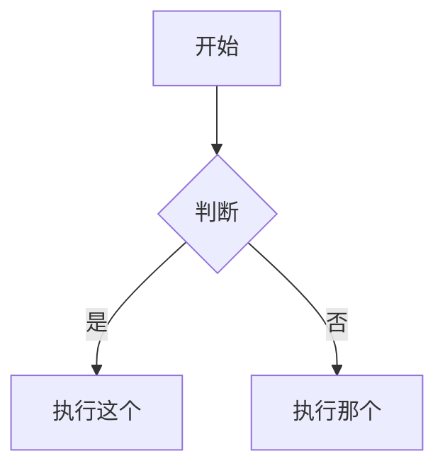

# Obsidian Flavored Markdown

创建和编辑合法的 Obsidian Flavored Markdown。Obsidian 在 CommonMark 和 GFM 之上增加了 wikilink、嵌入、callout、properties、注释等扩展。本 skill 只覆盖 Obsidian 特有部分，普通 Markdown（标题、粗体、斜体、列表、引用、代码块、表格）默认已知。

## 工作流：创建一篇 Obsidian 笔记

1. **先写 frontmatter**，把 `title`、`tags`、`aliases` 等属性放在文件顶部。属性类型见 [PROPERTIES.md](references/PROPERTIES.md)
2. **编写正文**，用普通 Markdown 组织结构，再按需加入 Obsidian 特有语法
3. **添加内部链接**：vault 内笔记用 `[[wikilink]]`；外部网址才用标准 Markdown 链接
4. **嵌入内容**：使用 `![[embed]]` 语法嵌入其他笔记、图片或 PDF。完整写法见 [EMBEDS.md](references/EMBEDS.md)
5. **添加 callout**：用 `> [!type]` 语法创建高亮提示块。完整类型见 [CALLOUTS.md](references/CALLOUTS.md)
6. **校验渲染**：在 Obsidian 阅读视图中确认笔记渲染正确

> 当需要在 wikilink 和 Markdown 链接之间做选择时：vault 内笔记一律优先 `[[wikilinks]]`，因为 Obsidian 会跟踪重命名；只有外部 URL 才用 `[text](url)`。

## 内部链接（Wikilinks）

```markdown
[[Note Name]]                          链接到笔记
[[Note Name|Display Text]]             自定义显示文本
[[Note Name#Heading]]                  链接到标题
[[Note Name#^block-id]]                链接到块
[[#Heading in same note]]              链接到当前笔记内标题
```

给任意段落追加 `^block-id` 即可定义块 ID：

```markdown
这一段可以被引用。 ^my-block-id
```

对于列表和引用块，块 ID 要放在块后面的独立一行：

```markdown
> 一段引用

^quote-id
```

## 嵌入

任意 wikilink 前面加 `!` 就会以内嵌方式显示：

```markdown
![[Note Name]]                         嵌入整篇笔记
![[Note Name#Heading]]                 嵌入某个章节
![[image.png]]                         嵌入图片
![[image.png|300]]                     按宽度嵌入图片
![[document.pdf#page=3]]               嵌入 PDF 指定页
```

音频、视频、搜索结果嵌入和外链图片见 [EMBEDS.md](references/EMBEDS.md)。

## Callouts

```markdown
> [!note]
> 基础 callout。

> [!warning] 自定义标题
> 带标题的 callout。

> [!faq]- 默认折叠
> 可折叠 callout，`-` 为默认折叠，`+` 为默认展开。
```

常见类型：`note`、`tip`、`warning`、`info`、`example`、`quote`、`bug`、`danger`、`success`、`failure`、`question`、`abstract`、`todo`。

完整别名、嵌套方式和自定义 CSS 见 [CALLOUTS.md](references/CALLOUTS.md)。

## 属性（Frontmatter）

```yaml
---
title: 我的笔记
date: 2024-01-15
tags:
  - project
  - active
aliases:
  - 备用名称
cssclasses:
  - custom-class
---
```

默认属性包括：

- `tags`：可搜索的标签
- `aliases`：用于链接建议的别名
- `cssclasses`：给阅读/编辑视图附加 CSS 类

完整属性类型、标签规则和进阶用法见 [PROPERTIES.md](references/PROPERTIES.md)。

## 标签

```markdown
#tag                    行内标签
#nested/tag             分层标签
```

标签可以包含字母、数字（不能作为首字符）、下划线、连字符和斜杠。也可以放在 frontmatter 的 `tags` 属性中统一定义。

## 注释

```markdown
这段可见 %%这里会隐藏%% 文本。

%%
这一整段在阅读视图里都会隐藏。
%%
```

## Obsidian 特有格式

```markdown
==高亮文本==
```

## 数学公式（LaTeX）

```markdown
行内：$e^{i\pi} + 1 = 0$

块级：
$$
\frac{a}{b} = c
$$
```

## 图表（Mermaid）

````markdown

````

如果要把 Mermaid 节点链接到 Obsidian 笔记，可添加 `class NodeName internal-link;`。

## 脚注

```markdown
带脚注的文本[^1]。

[^1]: 脚注内容。

行内脚注。^[这是行内脚注。]
```

## 完整示例

````markdown
---
title: 项目 Alpha
date: 2024-01-15
tags:
  - project
  - active
status: in-progress
---

# 项目 Alpha

这个项目希望通过现代方法来 [[改进工作流]]。

> [!important] 关键截止日
> 第一阶段里程碑截止到 ==1 月 30 日==。

## 任务

- [x] 初始规划
- [ ] 开发阶段
  - [ ] 后端实现
  - [ ] 前端设计

## 备注

该算法使用 $O(n \log n)$ 排序。细节见 [[算法笔记#排序]]。

![[Architecture Diagram.png|600]]

相关结论记录在 [[会议记录 2024-01-10#决策]]。
````

## 参考资料

- [Obsidian Flavored Markdown](https://help.obsidian.md/obsidian-flavored-markdown)
- [内部链接](https://help.obsidian.md/links)
- [嵌入文件](https://help.obsidian.md/embeds)
- [Callouts](https://help.obsidian.md/callouts)
- [属性](https://help.obsidian.md/properties)
